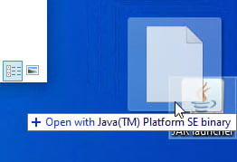

Using Minecraft-provided Java
=============================

If you are using official launcher to launch Minecraft, it downloads Java 8
for you without need to install it manually. You can use its bundled Java
to run regular JAR files (for example, to install OptiFine).

Finding a Minecraft Java
------------------------

Assuming you have Minecraft launcher installed and started it at least once,

1. Find its shortcut by opening Start menu and typing ‘Minecraft’ until it
   pops up in the list. Right click and select ‘Open file location’.

   .. image:: assets/find_mc.jpg
      :width: 400
      :alt: Screenshot of Windows search results for ‘Minecraft’ with steps
            added: 1st on search field, suggesting to type ‘Minecraft’, the
            2nd near cursor hovering on ‘Open file location’ sidebar option
            for the first highlighted result.

2. Most probably, Windows opened folder containing the Start menu shortcut.
   That is not a problem, just right click highlighted file and click ‘Open
   file location’ once again.

3. Now you're in the folder with ``MinecraftLauncher.exe`` file.

   Locate folder called ‘runtime’, inside of it folder ‘jre-x64’ is located,
   this is fully working Java copy. The executable files are located in ‘bin’.

   Example location:
   ``C:\Program Files (x86)\Minecraft Launcher\runtime\jre-x64\lib``

Congratulations, you have found bundled Java that you can use.

Creating a launch pad shortcut
------------------------------

The simplest way to launch JARs would be by creating a special shortcut that
you can drag JAR files onto to launch them.

To do so, given that you have found Java folder by following instruction above:

1. Go to executables folder (the ``bin`` one).

2. Find ``javaw.exe`` file.

3. Drag it on desktop while holding ``Alt`` key pressed.

   (the tooltip should say ‘Create a link in Desktop’).

4. Now a shortcut has been created. Right click it and choose
   :guilabel:`Properties`.

5. In ‘Target’ field type space and then ``-jar``.

6. Click :guilabel:`Apply`, :guilabel:`OK`. **Launch pad is created!**

         Java(TM) Platform SE binary’ tooltip.

You can test your launch pad by dragging any JAR file onto it, the tooltip
should say ‘Open with Java(TM) Platform SE binary’ and when you release your
mouse, the JAR will be opened as excepted.

.. raw:: html

   

Adding Java to the PATH & JAVA_HOME
-----------------------------------

**Path** is a system environment variable that specifies where programs
must look for other executable programs by default. You might want to add
Java's executables folder, ‘bin’.

**JAVA_HOME** is another environment variable that tells software dependent
on Java where it is located. It is roc

To set these variables, you need to open ‘Environment Variables’ window.
To do so, press ``Win`` + ``R`` and in ‘Open:’ field paste:

.. code-block::

   rundll32.exe sysdm.cpl,EditEnvironmentVariables

Follow these steps after the window is opened:

Path
""""

1. In ‘User variables’ table select ‘Path’ variable and click :guilabel:`Edit`.

2. Click :guilabel:`New` and then :guilabel:`Browse...`.

3. In ‘Browse For Folder’ dialog select Java's ‘bin’ folder, then click
   :guilabel:`OK`.

   For example:

   .. code-block:: text

      D:\Games\Minecraft\runtime\jre-x64\bin

4. Click :guilabel:`OK` to save changes to ‘Path variable’.

5. (Optionally) Click :guilabel:`OK` to save changes to variables.

JAVA_HOME
"""""""""

1. Under ‘User variables’ group click :guilabel:`New` button.

2. Enter ``JAVA_HOME`` as ‘Variable name’.

3. Press :guilabel:`Browse Directory...`.

4. In ‘Browse For Folder’ dialog select Java's folder, then click
   :guilabel:`OK`.

   For example:

   .. code-block:: text

      D:\Games\Minecraft\runtime\jre-x64\

5. Click :guilabel:`OK` to save changes to variables.

.. note:: You must log out of Windows in order for changes to apply.
